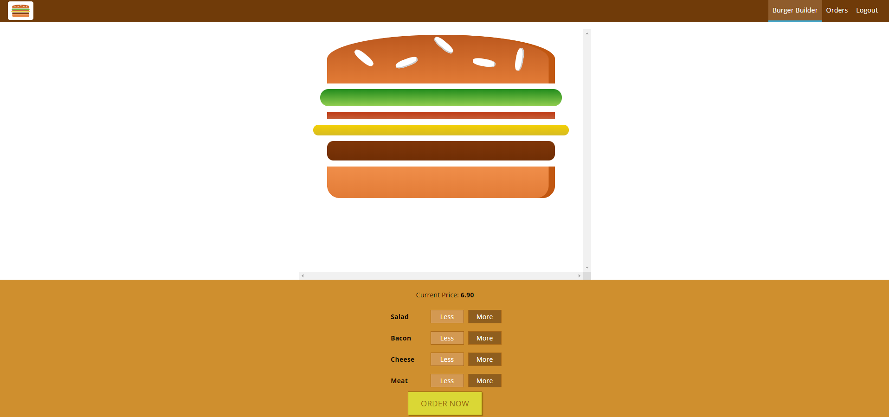
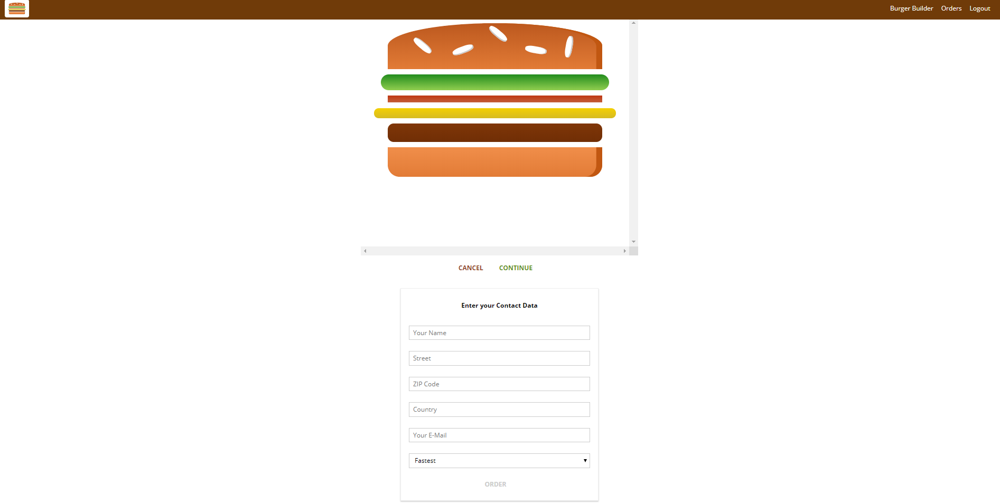
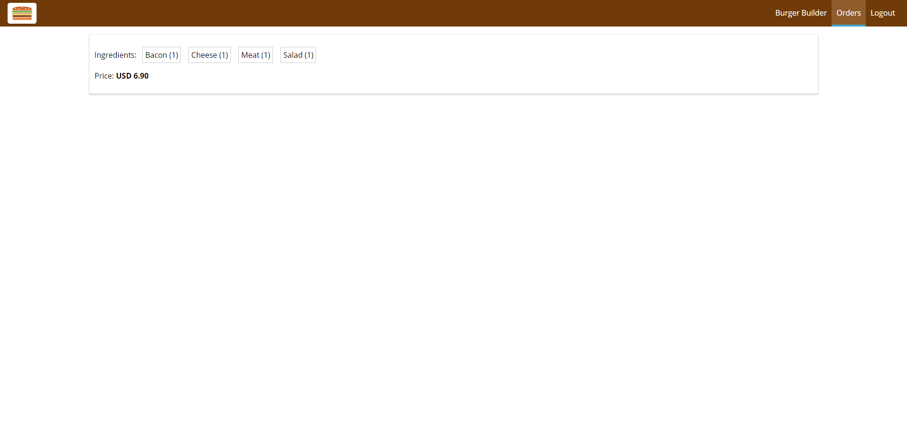

<p align="center">
 
</p>
<h1 align="center">
  Burger App
</h1>

[Deployed app](https://react-burger-application-a2cfd.web.app/)


***"Burger App"*** is a React app with data base on firebase.

This app was created during online course  [uedmy.com](https://www.udemy.com/course/react-the-complete-guide-incl-redux/)
***
###Test account
1. Email: test@test.com
2. Password: test1234
***
###Demo screenshots





-


***
###Technologies
1. ReactJS
1. Redux
1. Firebase real time database
***

###Opening project


1.  **Start developing.**

    Navigate into your new site’s directory and start it up.

    ```shell
    cd redux-adv-burger--01-async-action-ingredients
    npm start
    ```


    
  ***

###Project structure

A quick look at the top-level files and directories you'll see in a Gatsby project.

    .
    ├── .firebase
    ├── .idea
    ├── build
    ├── config
    ├── node_modules
    ├── public
    ├── scripts
    ├── src
        ├── assets
        ├── components
        ├── containers
        ├── hoc
        ├── store
        ├── App.js
        ├── axios-orders.js
        ├── index.css
        ├── index.js
        ├── registerServiceWorker.js
        ├── .firebaseserc
        ├── .gitignore
        ├── firebase.json
        ├── package.json
        ├── package-lock.json
        └── README.md
    └── .gitignore

  **`/src`**: This directory contains all of the modules of code that your project depends on (npm packages) are automatically installed.
  
  **`/assets`**: This directory contains images
  
  **`/components`**: This directory contains stateless components
  
  **`/containers`**: This directory contains statefull components
  
  **`/hoc`**: This directory contains higher order components components
  
  **`/store`**: This directory contains files cennected with redux
  
 
    
